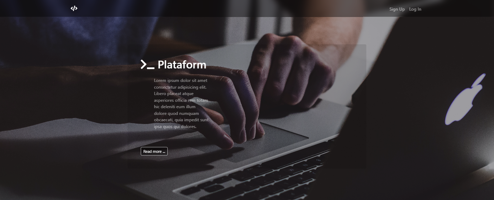
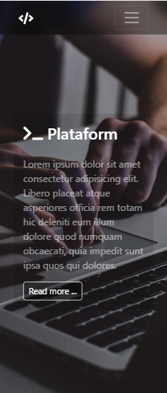

# Project create by Marcos Proença

## Before you start, download the dependencies | **_yarn_**

## Start the server with **_yarn dev_**

### Preview

-  desktop **(1805 x 737)**

   

-  mobile **(280 x 653)**

   

### **technologies used**

-  HTML
-  CSS
-  Bootstrap
-  MVC
-  Node JS
-  Ajax
-  Api-Rest
-  mssql
-  JavaScript
-  TypeScript
-  git
-  yarn

## **Front-end** && **Back-end**
